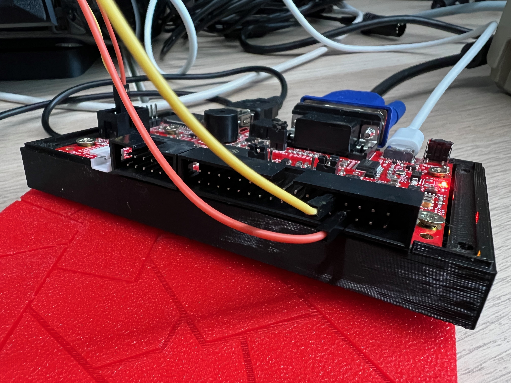

# Agon Electron HAL
The AgonLight is an amazing device combining retro vibes with a modern programming environment.

The Agon Electron Hardware Abstraction Layer will provide virtual hardware abstractions in the ESP32 'governor' that the EZ80 retro chip can talk to.

Although there is an excellent and more complete alternative called Quark Agon-VDP by Dean Benfield, I created my own attempt to something similar called Electron HAL. Because Quarks and Electrons together make (things that) Matter.

## Features
Currently this HAL has the following features:
- Host<->ESP32 terminal interface, bridging to EZ80
- ESP32<->EZ80 terminal interface connecting to Agon-MOS and other future EZ80 os-es like CP/M and MSX-DOS.
- EZ80 ZDI remote debugging
    - EZ80 status
    - EZ80 register contents
    - 4 HW breakpoints
    - Break/Step/Continue
    - Jump to memory location
- EZ80 ZDI memory access
    - read
    - write

## Hardware setup
To be able to use the ZDI interface we need to connect two GPIO pins that come from the ESP32 and connect them with the corresponding pins on the EZ80. I don't know what is wrong with either the schematic or silk screen but I connected pins 4 and 6 on the ZDI connector. Of course I first probed around to see if they where correct and they are.

To have the right setup you have to:
- Connect GPIO26 (pin 9) to TCK (pin 4)
- Connect GPIO27 (pin 8) to TDI (pin 6)

Below some detailed shots of the setup.



### Large memory transfers
One of the features of this special firmware is the ability to receive and send things to EZ80 memory by simple copying and pasting. This is done with the Intel HEX format which converts binary contents to a character stream. With tools like bin2hex and hex2bin you can convert from and to this format. You might want to automate this in your compilation setup. 

I got the best results with MiniCOM. I set the newline tx delay to 100ms. This way the ESP/EZ80 have some time to write thing to memory. Main reason is that the USB serial from host pc to ESP does not support hardware based overflow protection (RTS,CTS). Limitation of the current hw-design where RTS/CTS from the CH340 are used differently.


## Software setup
For the software setup you need the Arduino software or PlatformIO correctly configured. Check the Agon documentation how to do this. Then you can build, upload and flash the new ESP32 Agon Electron HAL to your board.

### Usage
At boot the Agon behaves like normal. Only it sits in Terminal character-only mode (for now). In this mode it will echo the output of MOS to the terminal but also output the same via USB serial to the host PC. And vice-versa, keyboard input on the host pc travels to the ESP which sends it to the EZ80.

## Enter ZDI mode
To enter ZDI mode you have to press CTRL-Z. You see the prompt changes from * to #. Also the version and revision of the EZ80 chip are shown. In this case 7.AA.

Now you can enter the following commands:
```
ZDI mode EZ80: 7.AA
#h
h               - this help message
b               - break the program
b address       - set breakpoint at hex address
d nr            - unset breakpoint
c               - continue the program
s               - step by step
r               - show registers and status
j address       - jump to address
x address size  - examine memory from address
:0123456789ABCD - data in Intel Hex format
```

All parameters are assumed to be HEX values. You can prepend them with 0x for clarity but that is not necessary.

So:
```
b 0xB0000
```
Is equal to:
```
b B0000
```

Addresses are assumed long-range ADL addresses using the 24-bit addressing range of the EZ80. Once I implement an ADL/Z80 mode switch I'll revisit this.

## Memory map in MOS
The EZ80's memory map depends on the firmware that was flashed into it. If you run MOS RC2 it looks like this:
```
512KB External RAM  = 00-0000 - 08-0000
8KB internal RAM    = 00-0000 - 00-2000

FF-FFFF
...
...
B7-FFFF		Internal Data RAM
B7-C000		Internal Data RAM
...
...
0C-0000		                        External RAM
0B-0000		SPL+SPS                 External RAM
0A-0000		SPL                     External RAM
09-0000		                        External RAM
08-0000		                        External RAM
07-0000		                        External RAM
06-0000		                        External RAM
05-0000		                        External RAM
04-0000		                        External RAM
03-0000
02-0000     Flash ROM
01-0000     Flash ROM
00-0000		Flash ROM
```

## Memory map after RESET
```
FF-FFFF		Internal Data RAM
FF-C000		Internal Data RAM
...
...
08-0000		                        External RAM
07-0000		                        External RAM
06-0000		                        External RAM
05-0000		                        External RAM
04-0000		                        External RAM
03-0000                             External RAM
02-0000     Flash ROM               External RAM
01-0000     Flash ROM               External RAM
00-0000		Flash ROM               External RAM
```

## Steps to use Adruino IDE instead of PlatformIO
* rename `src/main.cpp` to `src/hal.ino`
* copy contents of `include/` to `src/` (merging the directory structure)
* rename `src/` to `hal/`
* edit `platformio.ini` and add `"src_dir = hal"` under the `[platformio]` section
* install FabGL1.0.9
then you can compile & upload to your Agon Light
